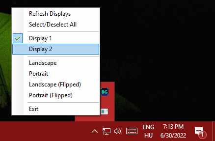

# QuickRotate

### Rotate displays quickly and easily from your system tray!

## Installation
1. Grab the latest release from the [Releases page](https://github.com/doczi-dominik/QuickRotate/releases)
2. Unzip the archive
3. Run `QuickRotate.exe`
4. *(optional) Add QuickRotate to the list of startup applications*
    1. Create a shortcut to `QuickRotate.exe` *(e.g.: by Right-click > Create shortcut)*
    2. Press `Win + R` to open up the Run prompt and type in `shell:startup`
    3. Drop the shortcut in the Startup directory

## Usage
- Right-click on the tray icon to bring up the menu
- Select the displays you want to change
- Click on the orientation you want to set

## Building
QuickRotate only depends on the .NET 6.0 SDK. You should be able to open it with Visual Studio without any issues.

## Credits
Huge thanks to Yosh from [StackOverflow](https://stackoverflow.com/questions/39288135/rotating-the-display-programmatically) for most of the native display management code.
